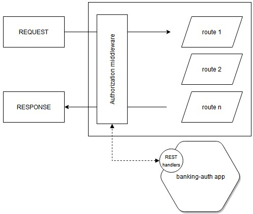
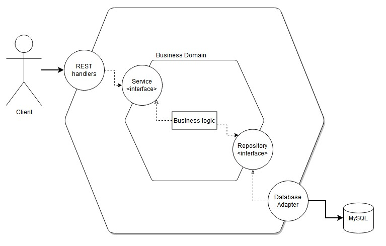

# cash-gopher-outside
Bank like application written in Golang.

## How to start

1. Clone this repo to your local environment

> git clone github.com/siwonpawel/cash-gopher-outside

2. Prepare MySQL database by executing script **banking/db.sql**
3. Execute *go mod download* inside **banking** and **banking-auth** directories
4. Build packages by executing *go build* inside **banking** and **banking-auth** directories
5. Start application in order
   1. banking-auth
   2. banking

By default application is running on database located on localhost with definied by default username / database name / password. To overwrite many properties of connection / start of application run application by specifing variables like below  
> banking.exe -APP_PORT=8080 -DB_USERNAME=banking_user

|       Property | banking | banking-auth | description                                                   |
| -------------: | :-----: | :----------: | :------------------------------------------------------------ |
|   AUTH_ADDRESS |    x    |              | address of banking-auth app instance ex. localhost:8081       |
| SERVER_ADDRESS |    x    |      x       | address where application is going to be served ex. localhost |
|    SERVER_PORT |    x    |      x       | port where application is going to be server ex. 8001         |
|    DB_PASSWORD |    x    |      x       | database password ex. tmp-password!11                         |
|        DB_USER |    x    |      x       | database user for application ex. banking                     |
|        DB_NAME |    x    |      x       | database name ex. banking                                     |
|        DB_HOST |    x    |      x       | database host ex. localhost, 127.0.0.1                        |
|        DB_PORT |    x    |      x       | database port ex. 3306                                        |

## How it's working

### REST endpoints

| Method | application  | endpoint                                              | description                                                 |
| -----: | :----------: | :---------------------------------------------------- | :---------------------------------------------------------- |
|    GET |   banking    | /customers[?status=active \| inactive]                | list of all users in database optionally filtered by status |
|    GET |   banking    | /customers/{customer_id}                              | gets user identified by customer_id                         |
|   POST |   banking    | /customers                                            | create new user                                             |
|   POST |   banking    | /customers/{customer_id}/account                      | create new account for user                                 |
|   POST |   banking    | /customers/{customer_id}/account/{account_id}         | create operation (withdrawal / deposit) on account          |
|   POST | banking-auth | /auth/login                                           | retrieve JWT token after successfull login                  |
|   POST | banking-auth | /auth/verify[?token,routeName,customer_id,account_id] | verify that user has access to required resources           |

See this [Postman collection](assets/cash-goopher-outside.postman_collection.json) for more detailed overwiew.

### Authorization

Banking application is main route for most of endpoints. It uses middlware to validate access to resources. Validation is executing by requesting from **banking-app** by REST service a response if token given by user is valid and if it can access specific endpoint in **banking**.

## How it's designed

Application is created in hexagonal architecture principles.

This allow us to crete new types of repositories and not to care about the implementation as long as all methods are specified on the type. Application contains domain, models, data objects, services, repositories, REST handlers and application configuration specific helpers. 
